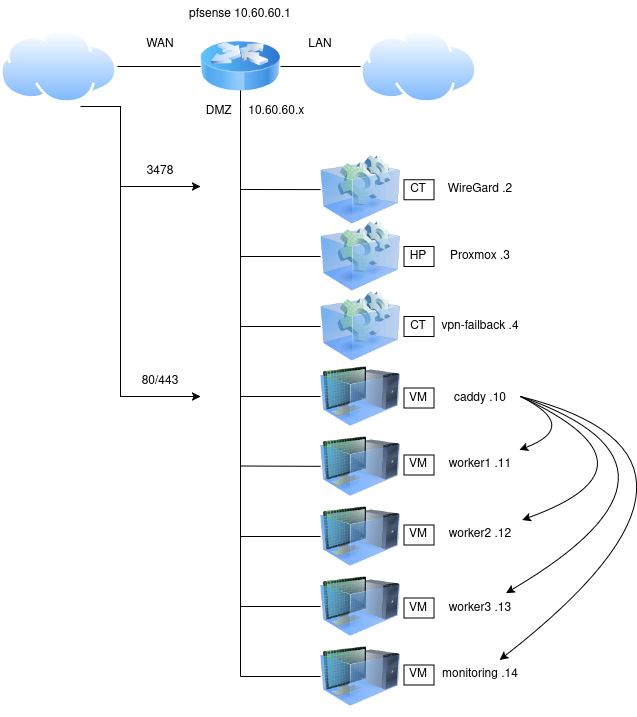

# terraform-proxmox-nixos-infra

Fully declarative and reproducible infrastructure on bare-metal Proxmox using
OpenTofu, NixOS, and Docker. Every resource, OS configuration, and secret is
defined in code — no manual state, no configuration drift.

## Table of Contents

- [Architecture](#architecture)
- [Technologies](#technologies)
- [Project structure](#project-structure)
- [Deployment pipeline](#deployment-pipeline)
- [Proxmox setup](#proxmox-ve)
- [OpenTofu](#opentofu)
- [NixOS](#nixos)
- [Secrets management with agenix](#secrets-management-with-agenix)
- [Services](#services)
- [Adding a new host](#adding-a-new-host)
- [Advantages and limitations](#advantages-and-limitations)

---

## Architecture

The project runs on a Dell rack server (Intel Xeon E5-2420 v2 @ 2.20 GHz,
12 cores, 32 GiB RAM, 6 × 136 GB HDDs in RAID 1+0) running Proxmox VE as
the hypervisor.

Three virtual networks are defined:

| Network | Purpose |
|---------|---------|
| **WAN** | Uplink to the internet |
| **LAN** | Internal network / intranet simulation |
| **DMZ** | Isolated zone for public-facing VMs |

Port forwarding on the router (pfSense, virtualised):
- `3478/udp` → WireGuard (VPN)
- `80/tcp`, `443/tcp`, `443/udp` → Caddy (reverse proxy in DMZ)

Remote access: **WireGuard** (primary, dual-member access) +
**Tailscale** (fallback, single-member).

All VMs accept only SSH public-key authentication and sit behind fail2ban.



### Virtual machines

| VM | VMID | IP | Cores | RAM | Role |
|----|------|----|-------|-----|------|
| caddy | 110 | 10.60.60.10 | 6 | 2 GB | Reverse proxy, TLS termination, load balancer |
| worker1 | 111 | 10.60.60.11 | 1 | 2 GB | General-purpose, Nginx + Docker |
| worker2 | 112 | 10.60.60.12 | 1 | 2 GB | General-purpose, Nginx + Docker |
| worker3 | 113 | 10.60.60.13 | 1 | 2 GB | General-purpose, Nginx + Docker |
| monitoring | 114 | 10.60.60.14 | 2 | 4 GB | Prometheus + Grafana |

---

## Technologies

| Tool | Role |
|------|------|
| [Proxmox VE](https://www.proxmox.com/en/) | Hypervisor / bare-metal host |
| [pfSense](https://www.pfsense.org/) | Virtualised firewall and router |
| [WireGuard](https://www.wireguard.com/) | Primary VPN for remote access |
| [Tailscale](https://tailscale.com/) | Fallback VPN |
| [OpenTofu](https://opentofu.org/) | IaC — VM provisioning on Proxmox |
| [NixOS](https://nixos.org/) | Declarative OS for all VMs |
| [nixos-anywhere](https://github.com/nix-community/nixos-anywhere) | Remote NixOS installer over SSH |
| [Colmena](https://github.com/zhaofengli/colmena) | Incremental NixOS config deployments |
| [disko](https://github.com/nix-community/disko) | Declarative disk partitioning |
| [agenix](https://github.com/ryantm/agenix) | Secret management with `age` encryption |
| [Docker](https://www.docker.com/) | Container runtime for services |
| [Caddy](https://caddyserver.com/) | Reverse proxy with automatic TLS |
| [Nginx](https://nginx.org/) | HTTP server on workers |
| [Prometheus](https://prometheus.io/) | Metrics collection and storage |
| [Grafana](https://grafana.com/) | Metrics visualisation |
| [fail2ban](https://www.fail2ban.org/) | SSH intrusion prevention |

---

## Project structure

```
.
├── grafana/
│   ├── dashboard.json
│   └── load-dashboard.sh
├── nixos/
│   ├── deploy-new-host.sh
│   ├── first-deploy.sh
│   ├── flake.lock
│   ├── flake.nix
│   ├── hosts/
│   │   ├── caddy/
│   │   │   ├── default.nix
│   │   │   ├── disk-config.nix
│   │   │   └── hardware-configuration.nix
│   │   ├── monitoring/  ...
│   │   ├── worker1/     ...
│   │   ├── worker2/     ...
│   │   └── worker3/     ...
│   ├── modules/
│   │   ├── caddy-config/
│   │   │   └── Caddyfile
│   │   ├── caddy.nix
│   │   ├── common.nix
│   │   ├── ddns.nix
│   │   ├── docker.nix
│   │   ├── fail2ban.nix
│   │   ├── grafana.nix
│   │   ├── neovim.nix
│   │   ├── nginx-indexes/  ...
│   │   ├── nginx_worker.nix
│   │   ├── node_exporter.nix
│   │   ├── prometheus.nix
│   │   ├── ssh.nix
│   │   ├── users.nix
│   │   └── utils.nix
│   └── secrets/
│       ├── cf-token.age
│       ├── grafana-admin-password.age
│       ├── grafana-secret-key.age
│       └── secrets.nix
└── terraform/
    ├── main.tf
    ├── tofu.sh
    └── variables.tf
```

Each host directory under `nixos/hosts/` has three files:
- `hardware-configuration.nix` — kernel modules for the Proxmox virtualised hardware
- `disk-config.nix` — partition layout (GPT + BIOS boot + ext4 root) via disko
- `default.nix` — host-specific config; imports the needed modules

Shared logic lives in `nixos/modules/` and is imported à la carte per host.

---

## Deployment pipeline

The full pipeline goes from an empty git repo to a running infrastructure in four steps:

```
OpenTofu  →  Cloud-init  →  nixos-anywhere + disko  →  Colmena
(VMs)        (bootstrap)    (install NixOS)             (day-2 ops)
```

### Step 1 — Provision VMs with OpenTofu

`terraform/main.tf` declares all five VMs (CPU, RAM, disk, network) and clones
them from a Debian 12 Cloud-init template.

> **Video demo — `tofu apply`** *(×10 speed-up — disk I/O on spinning HDDs makes provisioning slow)*
>
> <video src="doc/videos/terraform.mp4" controls width="100%"></video>

```bash
cd terraform
cp .env.dist .env
# fill in .env with your Proxmox API credentials
./tofu.sh init
./tofu.sh apply
```

To tear down all VMs:
```bash
./tofu.sh destroy
```

### Step 2 — Cloud-init bootstrap

On first boot, Cloud-init (declared from OpenTofu) configures the network,
injects SSH keys, and installs the Nix package manager — preparing each VM for
the NixOS takeover.

### Step 3 — Install NixOS with nixos-anywhere

Before the first deployment, capture the hardware configuration from the Debian
template (all VMs share the same virtualised hardware):

```bash
# Connect to the template VM
debian@template:~$ sudo $(which nix-shell) -p nixos-install-tools \
  --run "nixos-generate-config --no-filesystems --root /mnt"
debian@template:~$ cat /mnt/etc/nixos/hardware-configuration.nix
```

Copy the output into each `nixos/hosts/<host>/hardware-configuration.nix`.

Then generate pre-computed SSH host keys (so agenix can decrypt secrets from
the very first boot):

```bash
cd nixos
# generate host keys for a new host — see deploy-new-host.sh for details
./deploy-new-host.sh <hostname> debian@<ip> ~/.ssh/<your-key>
```

Run the initial deployment for all hosts:

```bash
cd nixos
./first-deploy.sh /path/to/your/ssh/key
```

`first-deploy.sh` calls nixos-anywhere per host, which:
1. Boots the Debian VM into a minimal in-memory NixOS environment via kexec
2. Partitions the disk with disko (`disk-config.nix`)
3. Installs NixOS and copies the host configuration
4. Transfers the pre-generated SSH host keys (deterministic, required by agenix)
5. Reboots into the fully configured NixOS system

> **Video demo — nixos-anywhere first deploy** *(×4 speed-up)*
>
> <video src="doc/videos/nix.mp4" controls width="100%"></video>

> **Note:** After the reboot the host key changes (no longer the Debian template).
> Clear the stale entry from known_hosts:
> ```bash
> ssh-keygen -R <host-ip>
> ```

### Step 4 — Day-2 changes with Colmena

After the initial install, all config changes are applied incrementally over
SSH — no reinstalls, no reboots required.

```bash
# Build without deploying (check for errors)
nix run github:zhaofengli/colmena -- build

# Deploy to all hosts in parallel
nix run github:zhaofengli/colmena -- apply --impure

# Deploy to a single host
nix run github:zhaofengli/colmena -- apply --on <hostname> --impure
```

Colmena reads the `colmena` output of `flake.nix`, builds the new system
generation locally, transfers it over SSH, and runs `nixos-rebuild switch` on
the target — activating changes in seconds.

Add an entry per host in `~/.ssh/config` so Colmena picks the right key:

```
Host 10.60.60.10
  IdentityFile ~/.ssh/<your-key>
Host 10.60.60.11
  IdentityFile ~/.ssh/<your-key>
# ... repeat for each host
```

---

## Proxmox VE

[Proxmox VE](https://www.proxmox.com/en/) is the bare-metal hypervisor that
hosts all VMs in this project. Version used: **9.1**.

After a fresh installation, access the web UI at `https://<proxmox-ip>:8006`
(default user: `root`).

### Create a user and role for OpenTofu

Run on the Proxmox node terminal:

```bash
pveum role add TerraformProv -privs "Datastore.AllocateSpace Datastore.Audit Pool.Allocate Sys.Audit Sys.Console Sys.Modify VM.Allocate VM.Audit VM.Clone VM.Config.CDROM VM.Config.Cloudinit VM.Config.CPU VM.Config.Disk VM.Config.HWType VM.Config.Memory VM.Config.Network VM.Config.Options VM.Migrate VM.PowerMgmt VM.GuestAgent.Audit VM.GuestAgent.Unrestricted SDN.Use"
pveum user add terraform-prov@pve --password <password>
pveum aclmod / -user terraform-prov@pve -role TerraformProv
```

### Create an API token for OpenTofu

```bash
pveum role modify TerraformProv -privs "Datastore.AllocateSpace Datastore.Audit Pool.Allocate Sys.Audit Sys.Console Sys.Modify VM.Allocate VM.Audit VM.Clone VM.Config.CDROM VM.Config.Cloudinit VM.Config.CPU VM.Config.Disk VM.Config.HWType VM.Config.Memory VM.Config.Network VM.Config.Options VM.Migrate VM.PowerMgmt SDN.Use"
pveum user token add terraform-prov@pve terraform-token --privsep 0
```

Output:
```
┌──────────────┬──────────────────────────────────────┐
│ key          │ value                                │
╞══════════════╪══════════════════════════════════════╡
│ full-tokenid │ terraform-prov@pve!terraform-token   │
├──────────────┼──────────────────────────────────────┤
│ info         │ {"privsep":"0"}                      │
├──────────────┼──────────────────────────────────────┤
│ value        │ <YOUR_API_TOKEN>                     │
└──────────────┴──────────────────────────────────────┘
```

Save `full-tokenid` and `value` in `terraform/.env` (see `.env.dist`).

---

## OpenTofu

[OpenTofu](https://opentofu.org/) is the open-source Terraform fork used to
declare and provision all VMs on Proxmox.

### Installation

```bash
# Arch Linux
sudo pacman -Syu opentofu

# Other distributions
# https://opentofu.org/docs/intro/install/
```

### Setup

```bash
cd terraform
cp .env.dist .env
# edit .env with your Proxmox API credentials
./tofu.sh init
```

`tofu.sh` is a thin wrapper that loads `.env` and forwards all arguments to
the `tofu` binary — keeping credentials out of the shell history and source code.

### Main configuration

`main.tf` declares the provider and all VMs via a `for_each` over a local map:

```hcl
provider "proxmox" {
  pm_api_url          = var.pm_api_url
  pm_api_token_id     = var.pm_api_token_id
  pm_api_token_secret = var.pm_api_token_secret
  pm_tls_insecure     = var.pm_tls_insecure
}

locals {
  vms = {
    caddy      = { vmid = 110, ip = "10.60.60.10", cores = 6, memory = 2048 }
    worker1    = { vmid = 111, ip = "10.60.60.11", cores = 1, memory = 2048 }
    worker2    = { vmid = 112, ip = "10.60.60.12", cores = 1, memory = 2048 }
    worker3    = { vmid = 113, ip = "10.60.60.13", cores = 1, memory = 2048 }
    monitoring = { vmid = 114, ip = "10.60.60.14", cores = 2, memory = 4096 }
  }
}
```

Each VM clones the Debian 12 Cloud-init template, inherits its SSH keys from
`var.sshkeys`, and gets a static IP in the DMZ (`10.60.60.0/24`).

---

## NixOS

[NixOS](https://nixos.org/) is the OS running on every VM. Its fully
declarative configuration model means the entire system state — packages,
services, users, firewall rules — is derived from the files in this repo.

### flake.nix

`nixos/flake.nix` is the entry point. It declares all external inputs
(`nixpkgs`, `agenix`, `disko`, `colmena`) and two outputs per host:
- `nixosConfigurations.<host>` — used by nixos-anywhere on first install
- `colmena.<host>` — used by Colmena for day-2 updates

Both outputs reference the exact same host modules, so the system definition
is always identical regardless of the deployment mechanism.

### Shared modules

| Module | What it does |
|--------|-------------|
| `common.nix` | Timezone, locale, GRUB (BIOS mode for Proxmox), base packages, flake support |
| `users.nix` | Centrally declared users; SSH public keys injected at build time; password login disabled |
| `ssh.nix` | SSH key type, `PasswordAuthentication = false` |
| `fail2ban.nix` | SSH jail — blocks IPs after repeated auth failures |
| `utils.nix` | Admin tools (`tmux`, `ripgrep`, `jq`, `wget`, …) |
| `neovim.nix` | Customised Neovim for all hosts |

### Host files

Each `nixos/hosts/<hostname>/` has:
- `hardware-configuration.nix` — Proxmox virtualised hardware (virtio, kvm-intel, …)
- `disk-config.nix` — GPT, BIOS boot partition, ext4 root (via disko)
- `default.nix` — imports the modules needed by this specific host

---

## Secrets management with agenix

[agenix](https://github.com/ryantm/agenix) encrypts secrets with
[age](https://age-encryption.org/) asymmetric crypto. Encrypted files are
committed to git — only holders of the listed private keys can decrypt them.

### How it works

Secrets are encrypted for a set of public keys in `nixos/secrets/secrets.nix`.
At boot, the agenix NixOS module decrypts them using the host's SSH host key
(`/etc/ssh/ssh_host_ed25519_key`) into `/run/agenix/` (tmpfs, cleared on
reboot). Services read secrets from that path at runtime.

Pre-computing SSH host keys (done by `deploy-new-host.sh`) ensures agenix can
decrypt secrets from the very first boot — if keys were generated randomly at
boot, each reinstall would invalidate all encrypted secrets.

### Access control — `nixos/secrets/secrets.nix`

```nix
let
  alex   = "ssh-ed25519 AAAA...";  # admin public key
  mario  = "ssh-ed25519 AAAA...";  # admin public key
  caddy  = "ssh-ed25519 AAAA...";  # host public key (root@nixos)

  all_admins = [ alex mario ];
in
{
  "cf-token.age".publicKeys = all_admins ++ [ caddy ];
}
```

Retrieve a host's public key with:
```bash
ssh root@<host-ip> "cat /etc/ssh/ssh_host_ed25519_key.pub"
```

### Creating or editing a secret

```bash
cd nixos/secrets

# Create or edit (opens $EDITOR with decrypted content)
nix shell github:ryantm/agenix -- -e <secret-name>.age --identity ~/.ssh/<your-key>
```

### Adding a new secret — full workflow

1. Add the entry in `nixos/secrets/secrets.nix`:
   ```nix
   "new-secret.age".publicKeys = all_admins ++ [ host ];
   ```

2. Create the encrypted file:
   ```bash
   cd nixos/secrets
   nix shell github:ryantm/agenix -- -e new-secret.age --identity ~/.ssh/<your-key>
   ```

3. Reference it in `nixos/hosts/<host>/default.nix`:
   ```nix
   age.secrets.new-secret.file = ../../secrets/new-secret.age;
   ```

4. Use the runtime path in a service:

   **NixOS service:**
   ```nix
   age.secrets.new-secret = {
     file  = ../../secrets/new-secret.age;
     owner = "myservice";
   };
   services.foo.passwordFile = config.age.secrets.new-secret.path;
   ```

   **Docker Compose** (`owner = "docker"` in host config):
   ```yaml
   services:
     myapp:
       image: myapp:latest
       volumes:
         - /run/agenix/new-secret:/run/secrets/new-secret:ro
   ```

5. Deploy:
   ```bash
   nix run github:zhaofengli/colmena -- apply --on <hostname> --impure
   ```

---

## Services

### Caddy — reverse proxy and load balancer

The `caddy` VM is the single entry point for external traffic. `caddy.nix`
enables `services.caddy` pointing to `modules/caddy-config/Caddyfile`.

Caddy handles:
- Automatic TLS via ACME / Let's Encrypt using a Cloudflare DNS-01 challenge
  (token managed by agenix — port 80 never needs to be exposed for cert issuance)
- Routing incoming requests to internal DMZ services via reverse proxy
- Round-robin load balancing across the three worker VMs

### DDNS — dynamic DNS (`ddns.nix`)

Since the public router IP can change, `ddns.nix` runs a Docker container
(`favonia/cloudflare-ddns:latest`) that checks the current public IP and
updates the Cloudflare DNS record on change. The Cloudflare token is injected
via agenix.

### Workers — Nginx index pages (`nginx_worker.nix`)

`worker1`, `worker2`, `worker3` each run an Nginx server serving a
host-specific index page (`index1.html`, `index2.html`, `index3.html` from
`modules/nginx-indexes/`). This lets you verify visually which backend Caddy
is hitting through the load balancer.

### Docker (`docker.nix`)

`docker.nix` enables the Docker daemon via
`virtualisation.docker.enable = true`, sets up the `docker` user group, and
creates systemd units that run `docker compose up` on boot. Compose files live
in `/srv/docker/<service>/`; secrets are bind-mounted from `/run/agenix/`
read-only.

### Monitoring — Prometheus + Node Exporter + Grafana

The `monitoring` VM centralises observability for the whole infrastructure:

- **`node_exporter.nix`** — enabled on *all* hosts; exposes CPU, memory, disk,
  and network metrics on port `9100`
- **`prometheus.nix`** — exclusive to `monitoring`; scrapes all node exporters
  (workers, caddy, router) plus Caddy's own metrics endpoint
- **`grafana.nix`** — exclusive to `monitoring`; starts Grafana with Prometheus
  auto-provisioned as a data source; dashboards are loaded via the Grafana REST
  API (`grafana/load-dashboard.sh`) and exposed through Caddy

---

## Adding a new host

To add a new host to the infrastructure:

1. Declare it in `terraform/main.tf` (add an entry to `locals.vms`).
2. Apply with OpenTofu:
   ```bash
   cd terraform && ./tofu.sh apply
   ```
3. Create the host directory and generate pre-computed SSH keys:
   ```bash
   cd nixos
   ./deploy-new-host.sh <hostname> debian@<ip> ~/.ssh/<your-key>
   ```
4. Add the host's public key to `nixos/secrets/secrets.nix` and re-encrypt any
   secrets it needs.
5. Run the first NixOS install:
   ```bash
   ./first-deploy.sh /path/to/your/ssh/key
   ```
6. Add subsequent config changes via Colmena:
   ```bash
   nix run github:zhaofengli/colmena -- apply --on <hostname> --impure
   ```

---

## Advantages and limitations

### Advantages

- **Full reproducibility** — the entire infrastructure can be recreated from
  scratch in minutes using only the git repository
- **Secrets in git, safely** — agenix encrypts secrets at rest; they are only
  decrypted at runtime in VM RAM, never written to disk in plaintext
- **Unified management** — NixOS + Colmena treat a fleet of servers as a
  single versioned artefact; one command updates all hosts in parallel
- **No configuration drift** — applying the same config twice always produces
  the same result

### Limitations

- **Steep learning curve** — Nix flakes and the Nix language require
  significant investment compared to traditional sysadmin approaches
- **Proxmox provider quality** — the `telmate/proxmox` provider can be slow
  to reconcile complex state changes; minor hardware config edits may trigger
  long VM restart cycles (amplified by spinning HDDs)
- **Incomplete automation** — two manual steps remain: creating the Proxmox
  API key via the web UI, and loading the Grafana dashboard via REST API
  (which breaks the fully declarative pattern)
